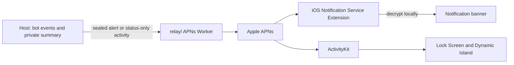

# Notifications, Live Activities and Dynamic Island

Updated: 2026-09-27. This describes the implemented notification contract and its delivery limits. Deployment and real-device acceptance are separate from local tests.

## Experience

| Event | Notification | Live Activity / Dynamic Island |
| --- | --- | --- |
| A task is sent from this iPhone | No alert | Start one activity for this bot as the message leaves: Sending (orb), then Working once the computer accepts it |
| The computer is offline (message waits in the relay mailbox) | No alert | Waiting for your computer (computer symbol), never marked delayed; Working when the computer picks it up |
| The message couldn't be sent | No alert (the chat shows Failed to send) | Failed, “Couldn't send”, then dismiss after 60 seconds; a message taken back out of the mailbox ends the activity |
| Working | No alert for each tool call | Bot identity and working orb |
| Input or permission needed | Bot name, “Response needed”, request summary; “Review request” action | Needs you; keep the activity alive |
| Completed (sent once the last queued message is answered) | Bot name, “Task complete”, final reply preview; “Open conversation” action | Done, then dismiss after 60 seconds |
| Failed (an error, or the turn stopped short: output/step limit, refusal) | Bot name, “Task failed”, failure summary; “Open conversation” action | Error state, then dismiss after 60 seconds |
| No fresh update for 15 minutes | No synthetic failure alert | Update delayed; never infer completion |

The encrypted title is limited to 80 characters and the body to 400 characters. The body is an excerpt of the agent's final answer, not a newly generated summary. System notification previews, text truncation, Focus, sounds and delivery timing remain controlled by iOS. There is no invented completion percentage or per-tool notification stream.

Notification actions open the scoped conversation. Permission approval still requires the normal in-app permission card. An account mismatch does not navigate into another account. Notifications are grouped by computer plus bot. Muted and hidden bots do not alert. The existing host-wide suppression while an iOS event connection is open remains in place; independent foreground suppression for multiple phones is not implemented.

Use Settings → Notifications to switch push notifications off for this iPhone (the app calls `unregisterDevice`, so every computer drops its alert ticket; Live Activities are unaffected), and to request access or open the iOS notification settings. Per-bot notification preferences remain in the bot editor. State → Live Activity controls automatic activity creation and shows system authorization. Turning it off ends this phone's activities. State → Dynamic Island shows the same switch: iOS renders one activity in both places and offers no island-only opt-out. The expanded island centers the bot name and current step under the camera, between the avatar and the orb (both vertically centered), so no text reaches the island's 44 pt corners. Its bottom row shows the elapsed time (from `startedAt`, counted by the system) or, when the bot needs you, a Review button that opens the conversation.

## Responsibilities and privacy



- `host/` owns event meaning, device tickets, task state and notification encryption.
- `relay/` holds the APNs signing key, opens opaque tickets and selects the APNs environment/topic. It has no notification decryption key.
- `cloud/` handles accounts and the encrypted connection. It is a separate service from the APNs Worker; no new Durable Object or D1 table is needed for this change.
- The notification extension decrypts the title, optional subtitle and body using the account context's shared Keychain key. This is local work and does not require a network fetch. [Apple notification content modification](https://developer.apple.com/documentation/usernotifications/modifying-content-in-newly-delivered-notifications)
- The extension then turns the alert into a communication notification (`INSendMessageIntent`) so the banner shows the bot's avatar instead of the app icon. A group alert carries the speaking member (`from`, sealed with the text) and shows as a group conversation: the group's avatar and name, with the member as sender. The sealed alert carries `faces` (name, shape and color of the chat, its first two members and the speaker), so a bot created while the app was closed still gets its avatar; alerts from an older host fall back to the widget snapshot in the App Group, and a bot in neither keeps the plain banner. Needs the app's Communication Notifications entitlement and `NSUserActivityTypes: INSendMessageIntent`. [Apple communication notifications](https://developer.apple.com/documentation/usernotifications/implementing-communication-notifications)
- ActivityKit renders both Lock Screen and Dynamic Island. A separate Dynamic Island Worker or event API is unnecessary. APNs updates use a dedicated activity token, not the normal notification token. [Apple ActivityKit push updates](https://developer.apple.com/documentation/ActivityKit/starting-and-updating-live-activities-with-activitykit-push-notifications)

Remote activity content contains only `status`, empty `activity`, and `startedAt`. Foreground app updates may show the current step from the encrypted connection; a remote update clears that free text. The notification service extension is not an ActivityKit decryption stage. The UI therefore does not promise private task summaries in background Live Activities. Bot identity and its deep link are set locally when starting the activity.

## Registration and lifecycle

1. iOS registers its APNs token with `POST /register` using `kind: alert` and its build environment.
2. The Worker returns an AES-GCM ticket. The phone sends it with its X25519 push public key and account context to `registerDevice` on the host.
3. Registration atomically replaces previous alert tickets for that device identity. Delivery also selects only the latest stored ticket per device, so existing duplicate rows cannot fan out before that phone reconnects. Randomized tickets must not accumulate, retain obsolete keys or generate duplicate notifications.
4. Sending a task starts an ActivityKit activity with `pushType: .token` in the local Sending state (Waiting for your computer when it goes to the mailbox); bot updates that aren't work yet don't end it. The phone registers each activity token using `kind: liveactivity`, then calls `registerActivity` for the bot.
5. Activity registration replaces the previous ticket for this device and bot. The app retries registration up to three times and reattaches token observers after reconnect/relaunch. Cancellation stops retries.
6. The host sends current state after registration, including terminal state if the task already finished. An idle bot with an unanswered main-chat user message waits for its actor to start rather than reporting immediate completion.
7. Status transitions send updates; idle/error sends an end event preserving that status and removes the activity tickets. The group view follows its member runtime using the existing group state logic.
8. App-local updates set a 15-minute stale date. Remote updates now do the same. A long task with no status transition may become stale; this is an honest “Update delayed”, not an assertion that its process stopped.

An existing activity can receive background APNs updates. Automatically starting activities for tasks initiated elsewhere is not enabled: that requires a separate push-to-start token flow and product preferences. Home Screen widgets keep their existing WidgetKit refresh scheduling and do not become real-time feeds through this change.

## Worker contract

Alert kinds are `done`, `needsInput`, and `failed`.

Hosts submit an event's alert requests in registration order to `POST /push-batch` as `{ "notifications": [<push request>, ...] }` (1–256 entries). The Worker decrypts the tickets and sends only the last request for each physical APNs destination, environment and token kind. It returns indexed statuses; superseded tickets and HTTP 410 results are forgotten by the host on its next push operation. Superseded identities also lose their older ticket rows so they cannot reappear on the next event. This requires no new database, no plaintext notification content, and no change to the ticket encryption scheme. Live Activity updates continue using `/push` because each activity has its own token.

 The public APNs alert always has title `Codync` and a useful fallback sentence. The encrypted payload carries the private fields. `mutable-content: 1` requests extension processing. The public routing fields are `botId`, `computerId`, and `ctx`; `thread-id` is `<computerId>:<botId>`.

Live Activity requests carry:

```json
{
  "ticket": "<opaque activity ticket>",
  "liveActivity": {
    "event": "update",
    "timestamp": 1790500000,
    "staleDate": 1790500900,
    "contentState": {
      "status": "needsInput",
      "activity": "",
      "startedAt": 812192700
    }
  }
}
```

`timestamp`, `stale-date`, and `dismissal-date` use Unix seconds. `startedAt` uses Swift Date's 2001 reference epoch. The Worker preserves the host event timestamp rather than replacing it with delivery time. Older hosts that omit it use Worker receipt time.

- Topic: `com.pokai.Codync.ios.push-type.liveactivity`; push type: `liveactivity`.
- Working updates use APNs priority 5; input requests and end events use 10.
- Updates set `stale-date`; ends set `dismissal-date` to event time plus 60 seconds. Expiration follows that deadline. Ordinary alerts expire after one hour.
- Invalid environment, kind, activity event, state or dates return 400. Remote activity free text is rejected. Alert custom data cannot overwrite `aps`; alert payloads larger than 4096 bytes return 413.
- Unregistered/bad device tokens return 410. Provider signing-token errors remain delivery errors and do not invalidate a device ticket.

Host delivery is currently best effort with a 10-second request timeout. There is no durable delivery queue or delivery receipt from iOS; a successful APNs response does not prove display. Second-resolution timestamps also do not provide a unique run identifier. Durable retries and activity identities per task would need a follow-up protocol change; this implementation does not claim exactly-once or guaranteed ordered delivery.

## Why only “Done” appeared

The previous public fallback was literally `Codync / Done`. Any missing `sealed`, `ctx`, inaccessible shared key, failed authentication or extension packaging problem kept that fallback. Device verification reproduced a more specific cause: five authorized device identities pointed to this phone. One current identity decrypted the completion normally; four obsolete identities produced generic fallbacks for the same event. The batched Worker path now selects the latest registration for the physical token across those identities.

Registration previously accumulated random tickets, including tickets with obsolete/missing push keys. Re-registering now removes those old records for the same device. The fallback itself now says “Your task is complete. Open Codync to read the result.” Failure and input requests have distinct fallback sentences.

For a phone that still shows fallback text:

1. Open the updated app and connect to the updated host so token/key registration completes.
2. Verify the installed app embeds `CodyncNotificationService.appex`, and the service principal class is the generated module's `NotificationService`.
3. Verify signed app and extension share the same expanded `CodyncKeychainGroup` and Keychain entitlement. Source plist equality alone does not verify a signed installation.
4. Inspect device logs for categories `Push`, `PushDecrypt`, and `NotificationService`. They distinguish missing keys, Keychain failures, failed content authentication/decoding and fallback delivery without printing keys or message contents.
5. Test after the first unlock following a reboot. Keys intentionally use `AfterFirstUnlockThisDeviceOnly`; pre-unlock fallback is expected.

## Configuration and release checks

The APNs Worker uses the existing secrets `APNS_TEAM_ID`, `APNS_KEY_ID`, `APNS_SIGNING_KEY`, and `TICKET_KEY`; see the [relay deployment guide](../../relay/README.md). Keep `TICKET_KEY` stable across deployments. Rotating it invalidates every existing ticket. Tickets are bearer capabilities accepted by the Worker and must not be logged.

The app bundle is `com.pokai.Codync.ios`. App and notification extension share `group.com.pokai.Codync` and the expanded shared Keychain access group. `project.yml` embeds both extension targets and enables `NSSupportsLiveActivities`; no new entitlement is required by these changes. Confirm sandbox versus production against the signed provisioning profile, especially for distribution builds.

Deployment order: Worker → host → iOS. The optional encrypted subtitle remains compatible with clients that decode only title/body. New clients accept older encrypted payloads without subtitles. The new `failed` category requires the updated app for its custom action. Follow the repository's stop-old-process/relaunch rules when installing builds.

### Acceptance matrix

| Check | Expected result |
| --- | --- |
| Re-register twice with a new key | One alert ticket for that device, latest key retained |
| Rotate an activity token | One ticket for that device and bot; other bots/devices unaffected |
| Task succeeds in background | Decrypted bot title, status subtitle, result excerpt; activity ends |
| Task fails in background | Failure alert and error activity; no success checkmark |
| Permission requested | Review action opens scoped conversation; activity stays live |
| Stop receiving state updates | Stale UI hides the old foreground step |
| Reopen app with an active activity | Token observer resumes and registration retries on transient failure |
| Wrong key / signed extension missing access | Readable generic fallback and a diagnostic log |
| Provider credentials expire | Device ticket is retained for credential repair |
| Worker receives private activity text / oversized alert | Rejected before APNs |

Local tests cover payload generation, error classification, request validation, ticket replacement, Swift payload decoding and crypto vectors. The signed device checks below cover extension execution and background ActivityKit delivery. Focus behavior, pre-first-unlock behavior, action navigation and OS-driven token rotation still need separate acceptance scenarios.

### Local verification — 2026-09-27

- Host: `cargo fmt --check`, `cargo clippy --all-targets -- -D warnings`, and all 148 unit/integration tests passed.
- Swift: `swift test --package-path kit` passed, 51 tests including encrypted push vectors and the optional notification subtitle.
- Relay: `npm test` and `npm run typecheck` passed, including malformed requests and activity payload checks.
- iOS: Debug simulator build passed with both extensions embedded. The built notification extension has the expected service entry point. Signing and device Keychain access were not verified by this unsigned build.
- Design document relative links and `git diff --check` passed. This initial check preceded deployment; see the device verification below.


### Deployment and device verification — 2026-09-27

- Deployed `codync-relay`, version `2ba1d27c-116c-423d-87e4-2a7749575bd3`; `/health` returned HTTP 200.
- Built and restarted the signed Mac app and its launchd host. The running host includes the new notification implementation; its health endpoint returned success.
- Built and installed the signed Debug iOS app on the paired iPhone 16 Pro Max. App and notification extension both resolve their shared Keychain group to `7FUM8A8H72.com.pokai.Codync`, with the matching App Group. The app uses the development APNs environment.
- The live host contained 191 tickets across five device identities. The active phone's group shrank from ten rows to one on reconnect. Added regression coverage ensures older groups also send through only their newest stored ticket.
- Two encrypted test alerts returned HTTP 200 from the deployed Worker/APNs path. Device logs confirm the notification service extension executed, with no recorded decryption failure for those tests.
- Debug device diagnostics read iOS-delivered notifications for the temporary verification bot and confirmed the decrypted title `Push verification`, subtitle `Task complete`, and final result body. The same inspection identified the four obsolete-identity fallbacks, leading to physical-destination deduplication in the Worker.
- A task started from the iPhone created a real Live Activity. While the app was on the Home Screen, an APNs needs-input update changed the Dynamic Island indicator to amber. Releasing the controlled host task ended the activity and removed its host ticket. The stale-date payload passed automated checks, but its delayed visual transition was not conclusively observed on the device.


For repeatable Debug-only acceptance, launch the app with `CODYNC_PUSH_VERIFY_BOT` set to the temporary test bot ID. The console's `CODYNC_PUSH_VERIFICATION` line reports only that bot's delivered notifications, current activities and authorization state. It does not expose keys, tickets, account IDs or other bots' notifications. Release builds do not include this diagnostic.

- The deployed batch endpoint received five tickets for one physical phone and returned four superseded results plus one successful delivery. Device diagnostics confirmed exactly one new decrypted notification and no additional generic fallbacks. The user also confirmed the complete title and body were visible.
- The updated running host executed controlled failure and success tasks. Its next delivery automatically removed obsolete identity rows, leaving one valid alert ticket in the live database.
- Final signed iOS and macOS Debug builds passed after the batch fix.

Set `CODYNC_PUSH_CLEAR_TEST_NOTIFICATIONS=1` alongside the Debug verification bot ID to remove only that bot's delivered test notifications after reporting them.

- Final device diagnostics confirmed one decrypted failure (`Push verification / Task failed / The agent failed.`), one additional decrypted success, no new generic fallback, and no remaining test activity. The temporary bot was deleted and its delivered notifications were cleared.
